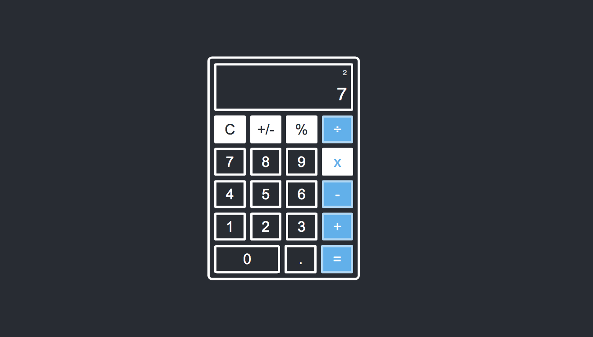

# Calculator

This project was completed as part of The Odin Projects Javascript Curriculum.

# 

## Table of contents

1. [Demo](#demo)
2. [Technologies](#technologies)
3. [Features](#features)
4. [Development](#development)
5. [License](#license)

## Demo

Here is the working live demo:
[https://benjamin-gambling.github.io/calculator/](https://benjamin-gambling.github.io/calculator/).

## Technologies

- Vanilla JS, ES6+

## Features

- VS Code Design
- Percentage operator
- Display previous value
- Operator Highlights
- Smooth flow by continuous sum through pressing operators and not equals

### Development

- Scientific

## License

> You can check out the full license [here](LICENSE)

This project is licensed under the terms of the **MIT** license.
